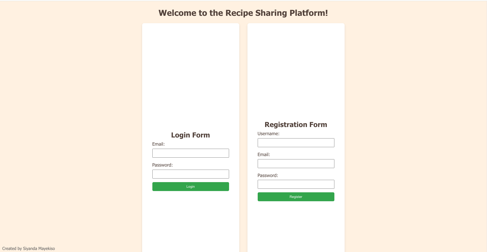
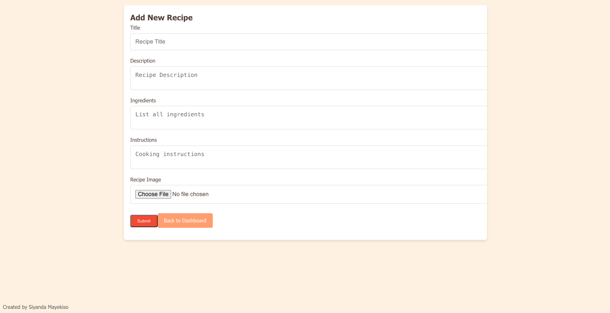
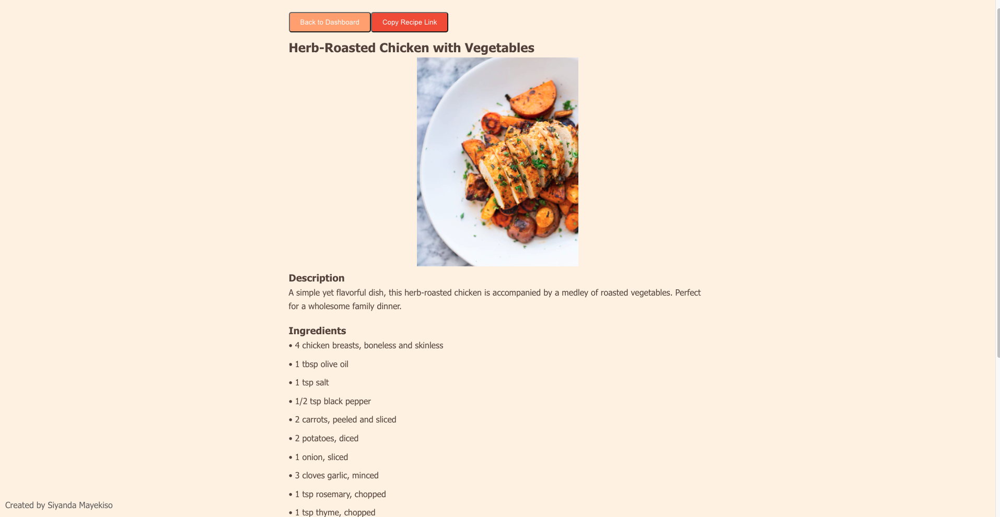

# Recipe Sharing Platform

## Description
The Recipe Sharing Platform is a web application that allows users to share their favorite recipes, complete with ingredients, cooking instructions, and images. The platform facilitates community interaction by enabling users to comment on and rate each other's recipes. Designed to be intuitive and user-friendly, it caters to both amateur cooks and professional chefs alike.

## Features

* User Authentication: Secure login and registration functionality for users.
* Recipe Management: Users can post, edit, and delete their recipes.
* Users can create a profile picture for in account.
* Responsive Design: Optimized for various devices and screen sizes.
* Image Upload: Integration with Cloudinary for efficient image handling.

## Technologies Used

### Frontend:

* React: For building the dynamic UI.
* React Router: For navigation within the application.

### Backend:

* Node.js: The runtime environment for running JavaScript on the server.
* Express: Framework used to build the web application.
* PostgreSQL: Database system for storing all user and recipe data.

### Authentication:

* JWT (JSON Web Tokens): For secure user authentication.

### Security:

* Bcrypt: For hashing and securing user passwords.

### Image Handling:

* Multer: Middleware for handling image uploads.
* Cloudinary: Cloud service for storing and serving images.

### Deployment:

* Heroku: Platform as a service (PaaS) for deploying the application.

## Live Application

The Recipe Sharing Application is deployed and available for use here:

https://recipe-sharing-platform-sm-8996552549c5.herokuapp.com/

## Application Screenshots

* **Home Page:**
  

* **Dashboard:**
  

* **Add New Recipe:**
  

* **Recipe Listing Page:**
  

* **Recipe Detail Page:**
  

* **User Profile Page:**
  
